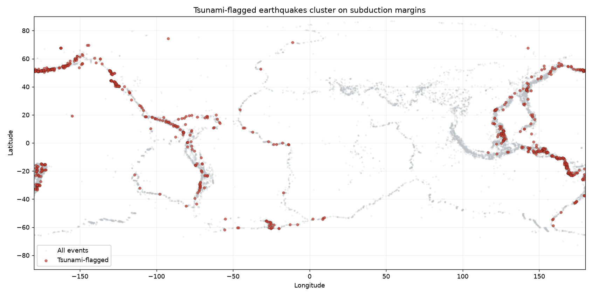
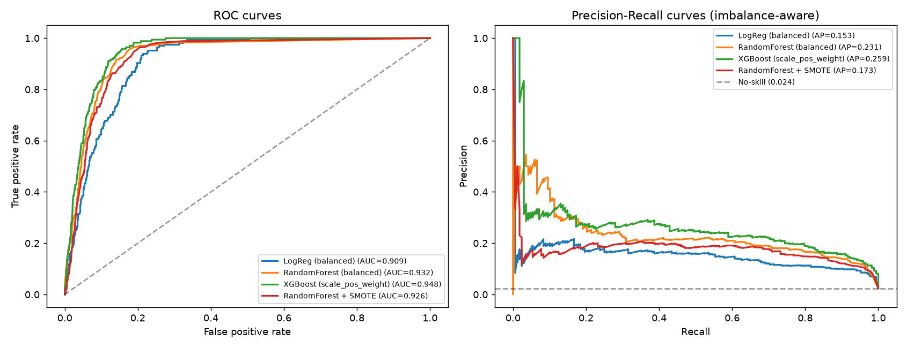

# Analyse sismique — Risque de tsunami & prédiction de magnitude

Aide à la décision pour un **système d'alerte précoce** : à partir des
caractéristiques d'un séisme (localisation, profondeur, magnitude, mesures
d'intensité), estimer rapidement **(1)** la probabilité qu'il déclenche un
tsunami et **(2)** sa magnitude probable, tout en caractérisant les
**dynamiques temporelles et spatiales** de la sismicité mondiale.

---

## 1. Problème métier

Les cellules de crise et les systèmes d'alerte doivent trier en quelques minutes
des milliers d'événements sismiques. Deux questions opérationnelles :

- **Faut-il déclencher une alerte tsunami ?** — un faux négatif (tsunami manqué)
  est bien plus coûteux qu'une fausse alerte. On optimise donc le **rappel**, pas
  l'accuracy.
- **Quelle est la magnitude probable** quand seules des mesures partielles sont
  disponibles ?

En complément, une lecture **spatio-temporelle** (tendance, saisonnalité,
hotspots) éclaire le dimensionnement des moyens de surveillance.

## 2. Données

- **Source :** [USGS Earthquake Catalog (FDSN API)](https://earthquake.usgs.gov/fdsnws/event/1/)
- **Périmètre :** tous les séismes de magnitude **M ≥ 5.5**, **1965 → 2024**
- **Volume :** **28 294** événements téléchargés → **28 044** séismes naturels
  après retrait des explosions (242 essais nucléaires, etc.)
- **Cible tsunami :** flag USGS `tsunami` — **674 événements positifs (2,40 %)**,
  soit un déséquilibre de classes marqué
- **Ingestion reproductible** paginée par année (contourne la limite de
  20 000 événements/requête) : `python src/data_download.py`

> Les CSV (brut + traité, < 6 Mo) sont versionnés pour que le repo soit
> auto-suffisant ; ils restent entièrement reproductibles via l'API — voir la
> section *Reproduction*.

## 3. Méthodologie

| Étape | Technique | Fichier |
|-------|-----------|---------|
| Ingestion API paginée | `requests` + retry exponentiel | `src/data_download.py` |
| Nettoyage & feature engineering | filtrage, énergie de Gutenberg-Richter, bandes de profondeur, familles de magnitude | `src/preprocessing.py` |
| Analyse temporelle | **Prophet** (tendance + saisonnalité annuelle) | `src/timeseries.py` |
| Classification tsunami | LogReg / **Random Forest** / **XGBoost** / SMOTE — 4 stratégies de déséquilibre | `src/classification.py` |
| Régression magnitude | **Linear Regression** vs **Gradient Boosting** | `src/regression.py` |
| Visualisation géospatiale | **Plotly** (carte interactive) + Matplotlib | `src/geoviz.py` |

**Deux familles de techniques** au minimum : séries temporelles (Prophet) +
apprentissage supervisé (classification & régression), avec en plus une approche
de rééquilibrage par sur-échantillonnage (SMOTE).

## 4. Résultats clés

### Classification tsunami (déséquilibre 2,4 %)

Métriques adaptées au déséquilibre (**PR-AUC** et **rappel**, pas l'accuracy) :

| Modèle | ROC-AUC | PR-AUC | F1 | Rappel @0.5 |
|--------|:------:|:------:|:--:|:----------:|
| LogReg (class_weight) | 0,909 | 0,153 | 0,191 | 0,839 |
| Random Forest (balanced) | 0,932 | 0,231 | 0,252 | 0,268 |
| **XGBoost (scale_pos_weight)** | **0,948** | **0,259** | **0,328** | 0,714 |
| Random Forest + SMOTE | 0,926 | 0,173 | 0,263 | 0,381 |

**Décision opérationnelle :** en calant le seuil sur un **rappel ≥ 90 %**
(seuil = 0,148), XGBoost capture **152 tsunamis sur 168** dans le jeu de test
(**rappel 90,5 %**) au prix d'une précision de 15,7 % — arbitrage cohérent pour
un système d'alerte où sur-alerter coûte moins cher que rater un événement.

### Régression magnitude

| Modèle | RMSE | MAE | R² |
|--------|:----:|:---:|:--:|
| Linear Regression | 0,360 | 0,269 | 0,187 |
| **Gradient Boosting** | **0,304** | **0,226** | **0,419** |

Le Gradient Boosting bat le baseline naïf (RMSE 0,399 → **0,304**), avec une
erreur absolue moyenne de **0,23 unité de magnitude**.

### Analyse temporelle

- Tendance haussière lente du nombre d'événements catalogués (largement un
  **artefact de détection** : densification du réseau mondial), ponctuée de pics
  d'aftershocks (2004, 2011).
- Saisonnalité annuelle faible (amplitude ~16 événements/mois sur un niveau
  moyen de 39) — cohérent avec le fait que la sismicité tectonique n'est **pas
  saisonnière**.

### Visuels (`reports/figures/`)

| | |
|---|---|
|  |  |
| Les tsunamis se concentrent sur les marges de subduction | Comparaison des 4 modèles (courbes PR) |

- Carte mondiale **interactive** : `reports/figures/earthquake_map.html`
- `annual_counts.png`, `prophet_forecast.png`, `prophet_components.png`,
  `monthly_energy.png`, `magnitude_pred_vs_actual.png`, importances de features.

## 5. Limites

- **Le flag `tsunami` de l'USGS** signale un contexte océanique à risque, pas
  systématiquement un tsunami observé — la cible est donc bruitée.
- **PR-AUC modeste (0,26)** : le déclenchement d'un tsunami dépend de facteurs
  côtiers fins (bathymétrie, distance aux côtes peuplées) que lat/lon ne capturent
  que grossièrement.
- **Régression de magnitude intrinsèquement limitée** : la magnitude est une
  propriété de la rupture, mal déterminée par la seule localisation ; les mesures
  d'intensité les plus informatives (`mmi`, `cdi`, `felt`) sont absentes pour
  50-84 % des événements anciens (imputées avec indicateur de manquant).
- **Biais de détection temporel** : la hausse des comptages reflète surtout
  l'amélioration de l'instrumentation, pas une hausse réelle de sismicité.
- Split aléatoire stratifié (non temporel) — un déploiement réel exigerait une
  validation *out-of-time*.

## 6. Reproduction

```bash
# 1. Environnement
conda create -n portfolio-ds python=3.11 -y
conda activate portfolio-ds
pip install -r requirements.txt

# 2. Pipeline complet (depuis la racine du projet)
python src/data_download.py            # télécharge le catalogue USGS -> data/raw/
python src/preprocessing.py            # nettoyage + features -> data/processed/
python src/timeseries.py               # analyse Prophet -> figures
python src/classification.py           # classification tsunami -> métriques + figures
python src/regression.py               # régression magnitude -> métriques + figures
python src/geoviz.py                   # cartes interactive + statique

# ou explorer le notebook narratif :
jupyter notebook notebooks/01_seismic_analysis.ipynb
```

## 7. Structure

```
01-seismic-tsunami-risk/
├── data/
│   ├── raw/            # catalogue USGS (versionné, reproductible via API)
│   └── processed/      # données nettoyées + features
├── notebooks/          # 01_seismic_analysis.ipynb (récit du projet)
├── src/                # data_download, preprocessing, timeseries,
│                       # classification, regression, geoviz
├── reports/
│   ├── figures/        # visuels exportés (png + html interactif)
│   ├── classification_metrics.csv
│   └── regression_metrics.csv
├── README.md
└── requirements.txt
```

---

### Résumé CV (FR)

> **Analyse sismique & alerte tsunami** — Pipeline de bout en bout sur le catalogue
> USGS (28 000 séismes, 1965-2024) : ingestion API, analyse temporelle Prophet,
> classification du risque de tsunami sur données déséquilibrées (XGBoost, ROC-AUC
> 0,95, rappel calibré à 90 % pour l'alerte précoce) et régression de la magnitude
> (Gradient Boosting). Cartographie interactive Plotly des hotspots de subduction.
